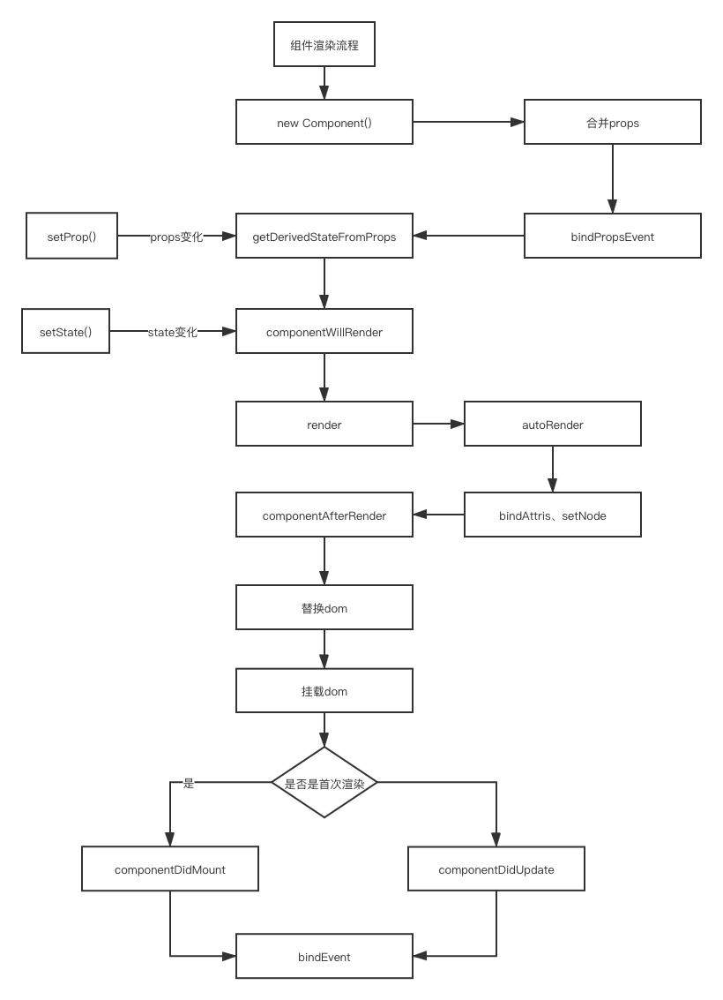
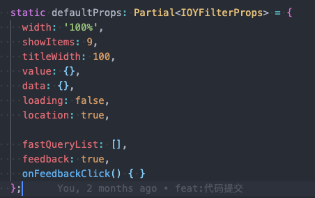
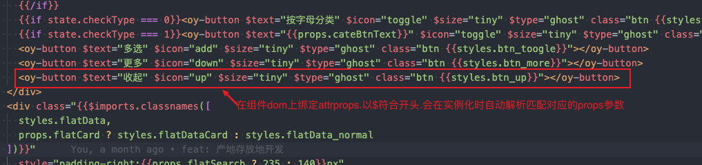

# 组件渲染流程

本文详细描述组件渲染构建流程.组件设计参照的是React的部分设计理念.所以会有很多相似之处.所有的组件都会有相同的渲染路径.
通过本篇文档.你将会详细的了解组件渲染构建过程.这非常有用.这会帮助你维护和开发组件.

一个标准的组件渲染构建流程如下图所示:



## 构建流程

当你通过$.OYXXX() 实例化一个组件时.组件就会进入以下的生命周期流程

### new Component()   构造组件

通过new 实例化一个组件

### 合并props

实例化完成之后.会合并外部选项props.

**按 defaultProps < attrProps < props的优先级将props进行合并**


```js
  props = { ...(constructor as any).defaultProps, ...this.getAttrProps($parent), ...props };
```

`defaultProps` 组件默认选项参数.



`attrProps` 参数可以通过js对象传递.也可以通过绑定在组件dom上进行传递.在组件实例化的过程中.会自动解析合并



```typescript
  /**
   * 获取组件attribute上的props参数。
   * @description 此类函数都是以$符号开头。横杠命名转为驼峰
   */
  protected getAttrProps(parent: JQuery = this.$parent) {
    const attrs = getAttributes(parent.get(0));
    const props: any = {};
    Object.keys(attrs).forEach(key => {
      const value = attrs[key];
      if (/^\$/.test(key)) {
        props[key.slice(1).replace(/-([a-z])/g, (_m, g1) => g1.toUpperCase())] = value;
      }
    })
    return props;
  }
```

### bindPropsEvent

绑定通过props传递进来的事件回调函数进行   

更多的事件请参照首页的[事件](../README.md)部分

```js
// 将实例化时传递的回调参数绑定到组件中.后续可以通过操作触发这些事件.
var filter = $('#oy-filter').OYFilter({
  onChange: function (value) {
    console.log(value)
  },
  onSearch: function (value) {
    filter.setProp({ value: value })
    console.log('onSearch', value)
  },
  onIndustryComponetClick() {
    this.setProp({})
  }
})

```

### getDerivedStateFromProps

执行getDerivedStateFromProps钩子函数

### componentWillRender

执行 componentWillRender钩子函数.在render函数执行之前执行.在这里你可以对state或是props做进一步的同步操作.用于后面的执行渲染

### render

执行render函数.渲染dom

### autoRender

如果组件装饰器jeact上设置了autoRunner:true. 那么该组件会自动执行组件内所有以`render[A-Z]`正则匹配的渲染函数.

**注** 如果你没有使用autoRuner.那么剩余的render函数必须自行在主render函数中执行.否则无法渲染剩余dom.以下是使用差异

#### 不使用autoRender

```js
@jeact() // <--- 使用或者不使用jeact
export default class OYRadio extends OY {
  static displayName = 'OYRadio';

  static defaultProps: IOYButtonProps = { }

  render() {
    this.$el = $(template({ props: this.props, state: this.state, styles }))
    
    // Attention: 必须手动调用剩余render函数
    this.renderCheckbox();
    this.renderTag();
  }

  renderCheckbox() {
    // ....渲染子多选框
  }

  renderTag() {
    // ....渲染子标签组件
  }

}
```

#### 使用autoRender

```js
@jeact({autoRender: true}) // <--- 声明autoRunnner
export default class OYRadio extends OY {
  static displayName = 'OYRadio';

  static defaultProps: IOYButtonProps = { }

  render() {
    // 这里不需要手动调用.jeact会自行根据声明顺序进行调用.
    // 因为没有了剩余的操作.你可以直接返回模版字符串. this.$el的绑定.jeact也会自动帮你处理好
    return template({ props: this.props, state: this.state, styles })
    
  }

  renderCheckbox() {
    // ....渲染子多选框
  }

  renderTag() {
    // ....渲染子标签组件
  }

}
```


### 将组件根上的attributes参数绑定到实际dom上

组件的渲染需要一个真实的dom节点作为载体.所以你可以在这个根节点上写一些参数.例如class、style等.
在这个阶段.组件会将这些属性绑定到生成的dom跟节点上

### setNode

每个组件类都必须实现setNode方法. 这个方法是用来缓存一些后续经常使用的JQuery节点.
如果你不需要缓存.那么只需要实现一个空函数即可.

### componentAfterRender

执行componentAfterRender钩子函数. render函数以及所有子render函数执行完毕后立即执行.
这里你可以安全的获取\$el、node节点等.你可以根据对dom做进一步的处理操作

### 替换dom

将生成的dom挂载到浏览器上

### componentDidMount、componentDidUpdate

在组件初次实例化后.会执行componentDidMount钩子函数
后续的setProp或setState会触发componentDidUpdate钩子函数

### bindEvent

绑定事件处理函数.在这个阶段.需要对渲染出来的Dom绑定对应的事件处理函数.
一般而言我们约定所有的绑定事件函数以`bindxx`开头.这样当你使用jeact装饰器的时候.能够自动捕获所有的事件绑定函数并执行绑定操作.

#### 当未使用jeact装饰器时.需要自行实现bindEvent函数并收集所有的事件绑定函数

```js
  bindEvent() {
    this.bindClick();
  }

  bindClick() {
    this.$el.delegate(`.${styles.radio_item}`, 'click', (ev: Event) => {
      const $this = $(ev.currentTarget!);
      if ($this.hasClass(styles.checked)) {
        return;
      }
      // 切换样式
      this.$el.find(`.${styles.radio_item}`).removeClass(styles.checked);
      $this.addClass(styles.checked)

      this.eventEmitter.emit('onChange', $this.data('value'))
    })
  }
```

#### 当使用jeact装饰器时.不需要实现bindEvent.且所有bind事件回调会自动收集并执行

```js

@jeact() // <-- 使用装饰器
export default class OYRadio extends OY {
  
  // ...ignore

  //   你不需要实现这个函数
  // bindEvent() {
  //   this.bindClick();
  // }

  // 所有的bind会被自动收集
  bindClick() {
    this.$el.delegate(`.${styles.radio_item}`, 'click', (ev: Event) => {
      const $this = $(ev.currentTarget!);
      if ($this.hasClass(styles.checked)) {
        return;
      }
      // 切换样式
      this.$el.find(`.${styles.radio_item}`).removeClass(styles.checked);
      $this.addClass(styles.checked)

      this.eventEmitter.emit('onChange', $this.data('value'))
    })
  }
}

```

**bindEvent is async**: bindEvent是异步执行的.在dom挂载完毕后再绑定
